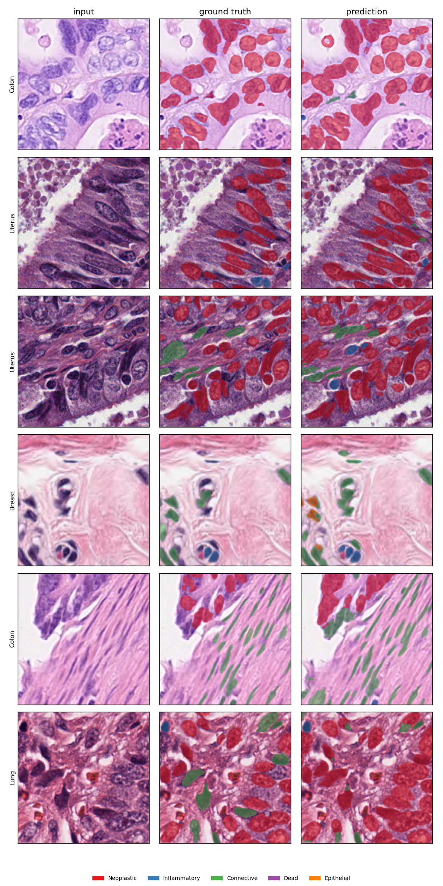

# MedSeg-RAI: Responsible Semantic Segmentation for Histopathology

Multi-class semantic segmentation of nuclei in H&E histopathology, paired with the
explainability, fairness, and monitoring layer that healthcare AI needs in practice.
The model segments five nucleus types plus background across 19 tissue types,
separates healthy tissue from degraded states (necrotic and neoplastic cells), and
comes with Grad-CAM explanations, per-pixel uncertainty, a per-subgroup fairness
audit, data-drift monitoring, and governance documents mapped to the IEEE ethical-AI
pillars and FDA Good Machine Learning Practice.


## Results in one line

On the PanNuke held-out test split (fold 3, 2722 images, with test-time augmentation),
the best model reaches a mean foreground Dice of 0.644 and pixel accuracy of 0.919.
Per-class Dice is 0.79 (Neoplastic), 0.76 (Epithelial), 0.67 (Inflammatory), 0.63
(Connective), and 0.36 (Dead). The full breakdown, training curve, confusion matrix,
fairness audit, and quantification readouts are in [docs/RESULTS.md](docs/RESULTS.md).



Input, ground truth, and prediction on test images.

## What changed from the baseline

| stage | setup | mean fg Dice | Dead Dice |
|---|---|---|---|
| baseline | U-Net, ResNet-34, CE + Dice | 0.554 | 0.152 |
| final | U-Net++, ResNet-50, Focal-Tversky + stain aug + TTA | 0.644 | 0.364 |

The rare Dead (necrotic) class was holding the average down. A Focal-Tversky loss with
gentler, clipped class weights more than doubled its Dice, and a larger encoder lifted
the rest. The fairness audit then flagged genuine gaps across tissue types and stain
brightness, which is what an honest audit is meant to do.

## How it maps to the role it was built for

| Requirement | Where it lives in this repo |
|---|---|
| Automated semantic segmentation that quantifies and classifies several complex classes at the microscopic level | [`medseg/train.py`](medseg/train.py), [`medseg/models/`](medseg/models), [`medseg/quantify.py`](medseg/quantify.py) |
| Evaluate healthy versus degraded biological states for therapeutic efficacy | [`medseg/quantify.py`](medseg/quantify.py), the tissue-degradation index |
| IEEE ethical-AI criteria (Accountability, Transparency, Algorithmic Bias, Privacy) | [`docs/ETHICS_IEEE.md`](docs/ETHICS_IEEE.md) |
| AI fairness analysis and algorithmic bias | [`medseg/fairness/`](medseg/fairness), per-tissue and per-brightness audit |
| Decision explainability | [`medseg/explain/`](medseg/explain), Seg-Grad-CAM and uncertainty maps |
| Rigorous model performance monitoring | [`medseg/monitoring/`](medseg/monitoring), drift detection and alerts |
| Healthcare and regulated-industry awareness | [`docs/REGULATORY.md`](docs/REGULATORY.md), [`docs/MODEL_CARD.md`](docs/MODEL_CARD.md), [`docs/DATASHEET.md`](docs/DATASHEET.md) |

## What it does

- Segmentation: U-Net or U-Net++ with an ImageNet-pretrained encoder via
  segmentation-models-pytorch, plus a dependency-free fallback, producing a 6-class
  pixel map.
- Quantification: connected-component counts, per-class area fractions, and a
  tissue-degradation index (degraded area over total cellular area) as a proxy readout
  for treatment response.
- Explainability: Seg-Grad-CAM to show which input regions drove a class, and
  uncertainty maps (softmax entropy and MC-dropout) to show where the model is unsure.
- Fairness: Dice and IoU per tissue type and per stain-brightness bin, with worst-group
  performance, the best-minus-worst gap, and the worst-over-best ratio.
- Monitoring: population-stability and KL drift detection on incoming image statistics,
  plus a performance monitor that logs metrics over time and raises alerts on threshold
  breaches.
- Governance: Model Card, Datasheet, IEEE ethics assessment, and FDA and HIPAA notes.

## Repository layout

```
medseg/
  config.py              Typed config with YAML and CLI merge
  data/
    pannuke.py           Load PanNuke from Hugging Face and convert masks to semantic labels
    dataset.py           Torch dataset, augmentation (incl. HED stain jitter), splits
  models/unet.py         U-Net and U-Net++ builder, fallback model, device selection
  losses.py              Dice, Tversky, and Focal-Tversky losses plus class weighting
  metrics.py             Confusion-matrix per-class Dice and IoU, robust mean
  train.py               Training loop (AdamW, cosine, early stop, checkpointing)
  evaluate.py            Test-set evaluation, TTA, confusion matrix
  quantify.py            Counts, areas, tissue-degradation index
  explain/               Seg-Grad-CAM and uncertainty
  fairness/              Per-tissue and per-brightness bias audit
  monitoring/            Drift detection and performance monitor
  app/gradio_app.py      Interactive demo
configs/
  default.yaml           Baseline run
  improved.yaml          Best run (U-Net++, ResNet-50, Focal-Tversky, stain aug)
scripts/
  download_data.py       Fetch PanNuke
  make_report.sh         Generate every figure for a trained run
docs/                    RESULTS, MODEL_CARD, DATASHEET, ETHICS_IEEE, REGULATORY
tests/                   Smoke test that runs without downloading data
```

## Quickstart

### 1. Environment 

```
python -m venv .venv && source .venv/bin/activate
pip install -U pip
pip install -e ".[full]"        # or: pip install -r requirements.txt
```

### 2. Smoke test

```
pytest -q
```

The logic tests (mask conversion, metrics, quantification, fairness, drift, model forward,
Grad-CAM) run anywhere. A one-epoch end-to-end training test runs on a small real-data slice
when data/pannuke is present, and skips otherwise.

### 3. Get the data (PanNuke)

```
python scripts/download_data.py --root data/pannuke
```

PanNuke is a free academic dataset of roughly 7,900 patches at 256 by 256, with 5
nucleus classes across 19 tissue types in 3 folds. See [docs/DATASHEET.md](docs/DATASHEET.md).

### 4. Train

```
# baseline
python -m medseg.train --config configs/default.yaml

# best configuration (U-Net++, ResNet-50, Focal-Tversky, stain aug)
python -m medseg.train --config configs/improved.yaml --run-name pannuke_resnet50
```

### 5. Evaluate and make every figure

```
python -m medseg.evaluate --run outputs/pannuke_resnet50 --tta
bash scripts/make_report.sh outputs/pannuke_resnet50
```

`make_report.sh` writes the confusion matrix, per-tissue fairness, brightness fairness,
quantification charts, Grad-CAM overlays, the qualitative panel, and the training curve
into the run folder.

### 6. Explore, audit, monitor, demo

```
python -m medseg.fairness.audit     --run outputs/pannuke_resnet50
python -m medseg.quantify           --run outputs/pannuke_resnet50
python -m medseg.monitoring.monitor --run outputs/pannuke_resnet50
python -m medseg.app.gradio_app     --run outputs/pannuke_resnet50
```

## How this transfers to other healthcare roles

The organ is incidental. The competencies are general. The same pipeline maps onto:

| Target domain | What you swap in | What stays the same |
|---|---|---|
| Radiology (CT, MRI, X-ray) | 3D U-Net and a DICOM loader | losses, metrics, fairness, monitoring, governance |
| Ophthalmology (fundus, OCT) | vessel or lesion masks | the whole responsible-AI layer |
| Dermatology | clinical photographs | explainability and bias audit |
| Cell biology and drug discovery | live-cell microscopy | quantification and degradation index |

Only the data layer (`medseg/data/`) is dataset-specific. Everything else is
modality-agnostic.

## Responsible AI and governance

- Accountability: versioned configs, fixed seeds, full run artifacts, and a Model Card.
- Transparency: Grad-CAM and uncertainty make each prediction inspectable, and the
  Datasheet documents data provenance and known biases.
- Algorithmic bias: the fairness audit measures disparities across tissue and stain
  subgroups before deployment, and reports the worst group rather than the average.
- Privacy: guidance on de-identification (HIPAA Safe Harbor) and the use of public,
  consented research data.

See [docs/ETHICS_IEEE.md](docs/ETHICS_IEEE.md) and [docs/REGULATORY.md](docs/REGULATORY.md).


## License and citation

Code is MIT licensed. PanNuke is released for non-commercial research; cite Gamper et al.
(2019 and 2020). Full references are in [docs/DATASHEET.md](docs/DATASHEET.md).
