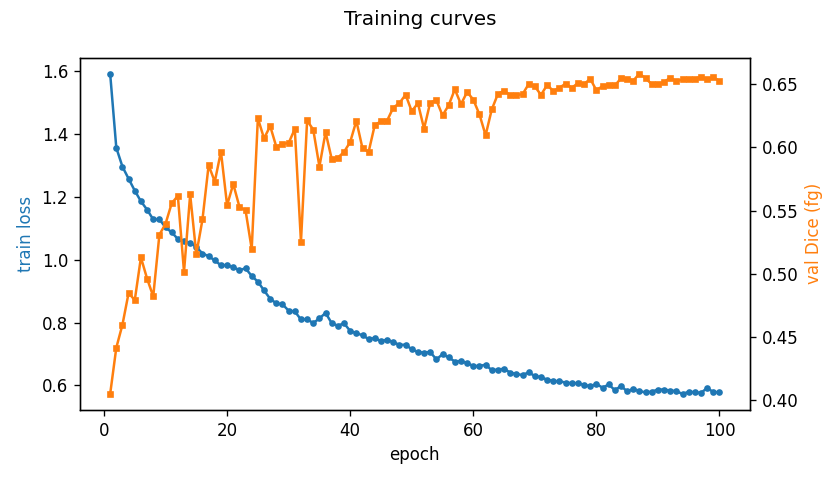
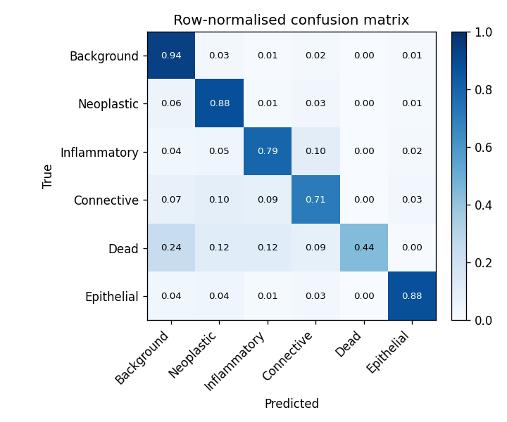
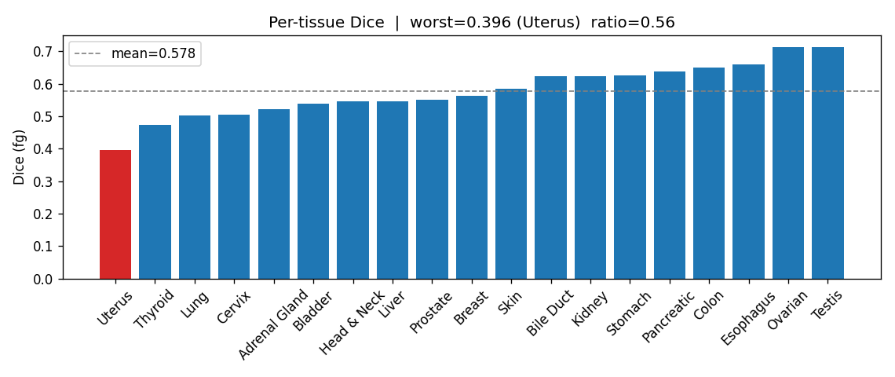
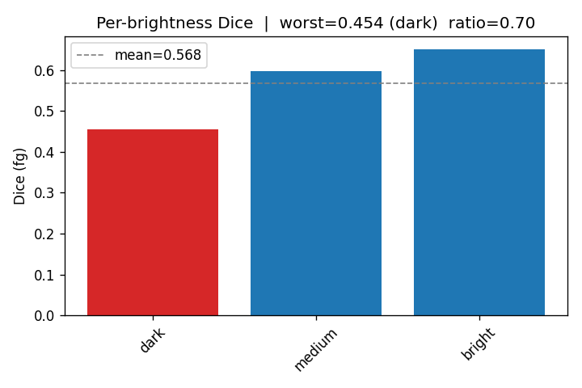
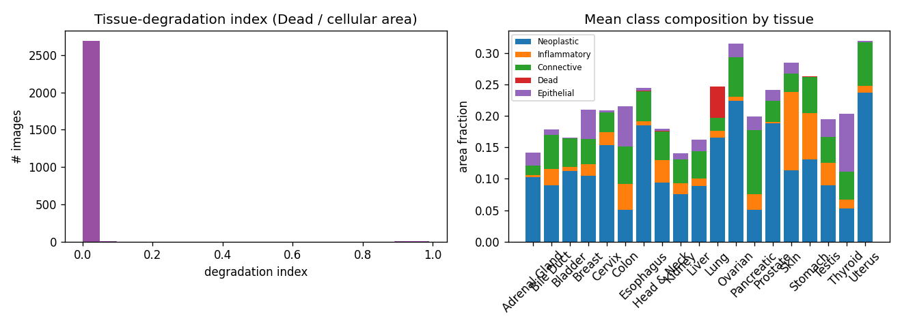

# Results

All numbers below are on the PanNuke held-out test split (fold 3, 2722 images).
Training used folds 1 and 2, with 15 percent of that held out for validation. The
final model is a U-Net++ with a ResNet-50 encoder, trained for 100 epochs on Apple
Silicon (MPS). Evaluation uses flip-based test-time augmentation (TTA).

To reproduce:

```
python -m medseg.train --config configs/improved.yaml --run-name pannuke_resnet50
bash scripts/make_report.sh outputs/pannuke_resnet50
```

## Headline (test, with TTA)

| metric | value |
|---|---|
| mean foreground Dice | 0.644 |
| robust mean Dice (Dead excluded) | 0.714 |
| mean foreground IoU | 0.492 |
| pixel accuracy | 0.919 |

## Per class Dice

| class | Dice |
|---|---|
| Background | 0.962 |
| Neoplastic | 0.794 |
| Epithelial | 0.757 |
| Inflammatory | 0.671 |
| Connective | 0.633 |
| Dead | 0.364 |


Input, ground truth, and prediction on test images.

## How the model got better

Three stages, all measured on the same test split.

| stage | setup | mean fg Dice | Dead Dice | pixel acc |
|---|---|---|---|---|
| baseline | U-Net, ResNet-34, CE + Dice, 40 epochs | 0.554 | 0.152 | 0.886 |
| better loss | U-Net++, ResNet-34, Focal-Tversky, stain aug, TTA | 0.605 | 0.306 | 0.908 |
| more capacity | U-Net++, ResNet-50, 100 epochs, TTA | 0.644 | 0.364 | 0.919 |

The largest single gain came from the loss. The Dead class is rare and was the main
thing pulling the average down. Switching from Dice to Focal-Tversky, which penalises
missed pixels more than false positives, and replacing the very large inverse-frequency
class weight (around 45 for Dead) with a gentler square-root weight clipped at 10, about
doubled the Dead Dice. Moving from ResNet-34 to ResNet-50 then lifted every class a bit
more.




## Fairness audit

The audit runs without TTA, so its overall figure (0.635) sits slightly below the
headline. What matters is the spread across groups, not the average.

By tissue type (19 groups):

| measure | value |
|---|---|
| best group | Testis, 0.714 |
| worst group | Uterus, 0.396 |
| best minus worst gap | 0.318 |
| worst over best ratio | 0.56 |
| coefficient of variation | 0.14 |
| flagged | yes (fails the four-fifths rule) |

By stain brightness, a proxy for scanner and staining differences:

| group | Dice |
|---|---|
| bright | 0.651 |
| medium | 0.599 |
| dark | 0.454 |

The dark group is clearly weaker. That is the kind of stain-driven gap a deployment
review needs to see. Note also that several tissue groups have small test counts
(Pancreatic 28, Kidney 41, Skin 41, Lung 51 images), so their per-tissue numbers are
noisy and should be read with that in mind.




## Quantification readouts

Averaged over the 2722 test images, the model reports:

- neoplastic fraction around 0.41 of cellular area, which fits a pan-cancer dataset
- degradation index around 0.006 overall (Dead area over total cellular area)

The degradation index is near zero for most tissues but reaches 0.24 for Lung, which
lines up with lung samples in PanNuke carrying more necrotic tissue. This is the type
of readout used to compare healthy and degraded states and to track treatment response.



## Limitations to keep in mind

- This is a research model trained on one public dataset, not a validated device.
- Dead stays the hardest class because it is rare and visually subtle.
- Small tissue groups give noisy per-group numbers.
- The fairness gaps are real and are reported here rather than hidden behind an average.
